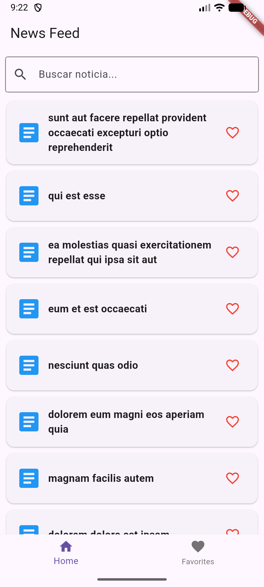
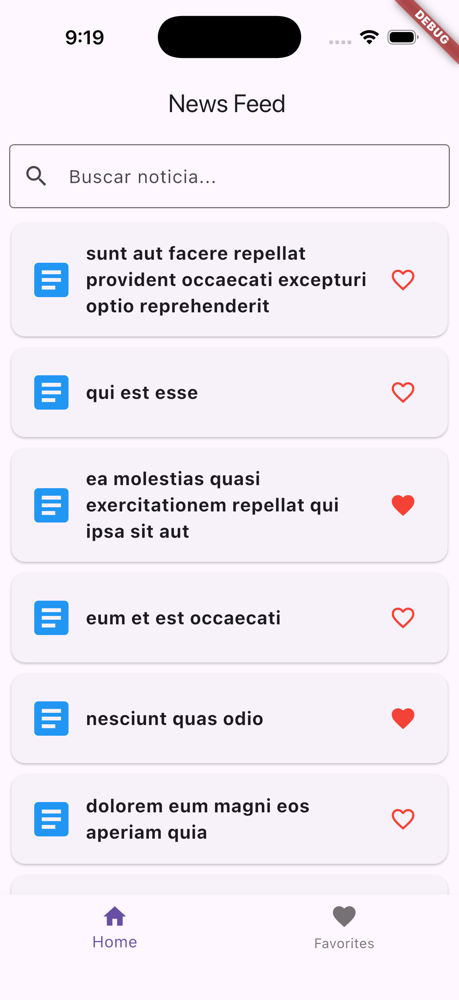
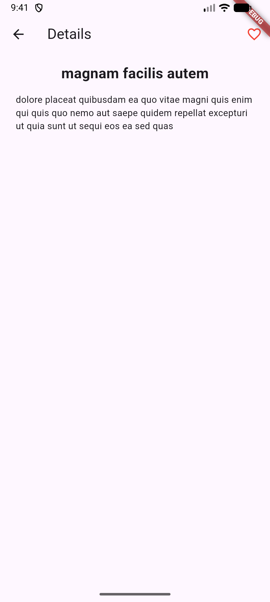
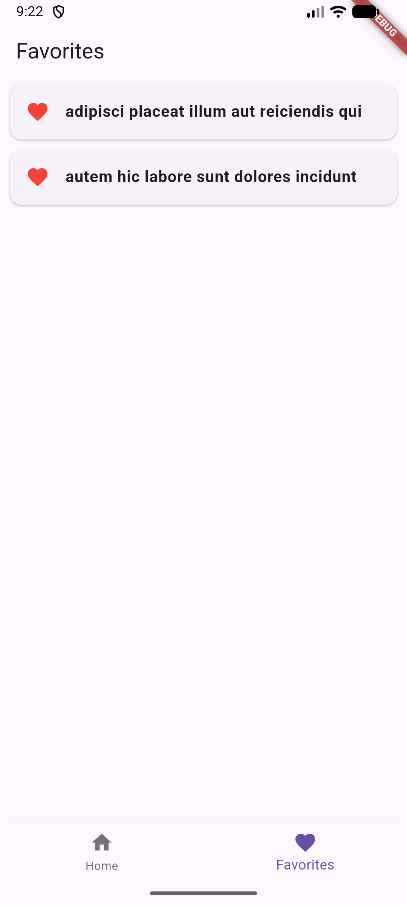
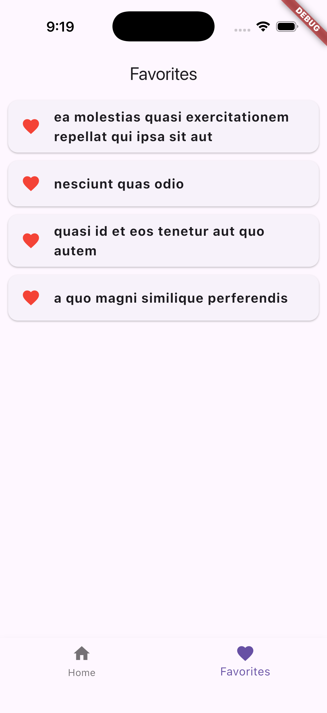
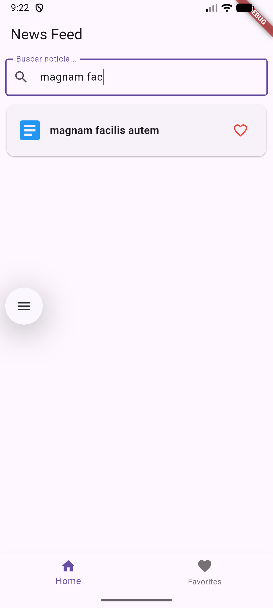
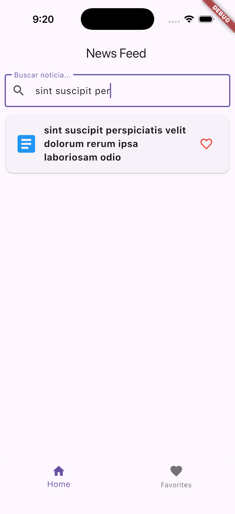

# prueba_tecnica

Aplicación movil desarollada en Flutter como una prueba técnica.

La aplicación obtiene datos de un API pública de noticias y pueden agregarse como favoritos. 

## Tecnologías utilizadas

- Flutter
- Dart
- HTTP
- SharedPreferences
- HTMl

## Funcionalidades

- Consumo de API pública de noticias
- Buscador de noticias
- Vista de detalles por medio de inyeccion html
- Guardar como favoritos por medio de libreria SharedPreferences
- Navegación entre pantallas de inicio y favoritos

## Capturas de pantalla

Esta aplicación es funcional tanto en Android como iOS gracias a Flutter.

### Home

    
    

### Detalles

    
    

### Favoritos

    
    

### Busqueda

    
    

## Instalación

Debes de contar con la instalación de flutter, android studio y simuladores (iOS y Android).

- Clonar repositorio:
    git clone https://github.com/carlospolanco1711-web/PruebaTecnica.git

- Entar al proyecto
    cd PruebaTecnica

- Instalar dependencias
    flutter pub get

- Ejecutar aplicación 
    flutter run

## Autor

Carlos Enrique Gonzalez Polanco
